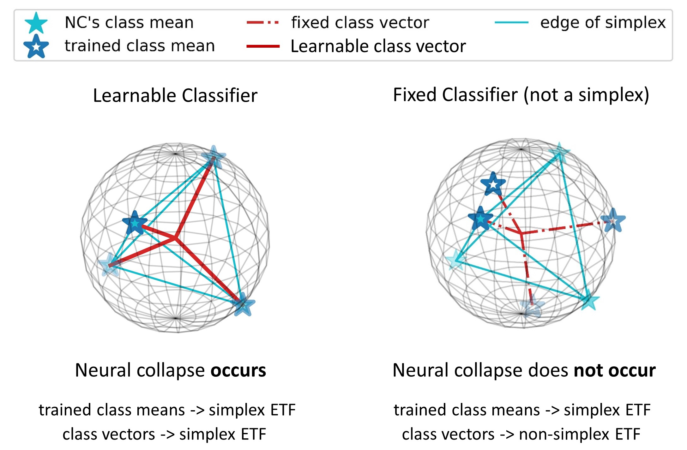

# Fixed Non-negative Orthogonal Classifier: Inducing Zero-mean Neural Collapse with Feature Dimension Separation

This repository is the official implementation of Fixed Non-negative Orthogonal Classifier: Inducing Zero-mean Neural Collapse with Feature Dimension Separation (ICLR 2024) by Hoyong Kim and Kangil Kim.

## Contributing

T.B.A
