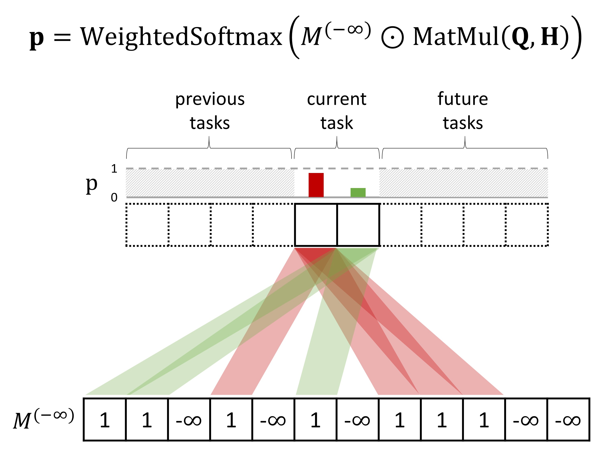

# Fixed Non-negative Orthogonal Classifier: Inducing Zero-mean Neural Collapse with Feature Dimension Separation

This directory is the official implementation of the par of Continual Learning in Fixed Non-negative Orthogonal Classifier: Inducing Zero-mean Neural Collapse with Feature Dimension Separation.



## Experimental Details

### General Settings

We set the below settings for all experiments

- GPUs: Galaxy 2080TI classic x 1
- CPU cores: 16
- Memory: 128 GB
- NVIDIA Driver: 460.80
- CUDA version: 10.2


## Requirements

To create an environment:

```setup
conda create -n myenv python=3.9.7
conda install pytorch==1.13.1 torchvision==0.14.1 torchaudio==0.13.1 pytorch-cuda=11.7 -c pytorch -c nvidia
```

To install requirements:

```setup
pip install -r requirements.txt
```

## Training and Evaluation

To train and test the model(s) in this task, run this command:

```
python utils/main.py \
--model {er,ermr,orthermr,derpp,derppmr,orthderppmr} \
--dataset {seq-mnist,seq-cifar10,seq-cifar100,seq-tinyimg} \
--buffer_size {200,500,5120} \
--load_best_args \
--nowand {0,1}
```


## Reference

[Mammoth - An Extendible (General) Continual Learning Framework for Pytorch](https://github.com/aimagelab/mammoth/tree/master)

## Contributing

T.B.A

